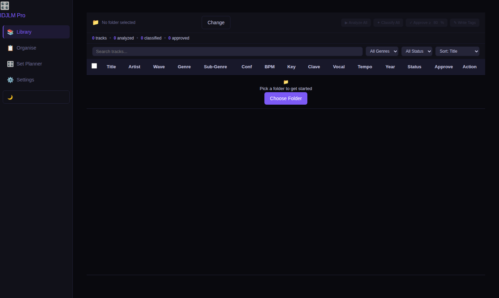

<p align="center">
  
</p>

# IDJLM Pro

**Intelligent DJ Library Manager** — AI-powered genre + sub-genre classification for Latin dance music libraries.

**For:** DJs with Salsa, Bachata, Kizomba (and more) collections who want to bulk-classify tracks and write clean ID3 tags so djay Pro smart playlists just work.



## Download

Get the latest release from [Releases](../../releases/latest):
- **macOS** — download `IDJLM-Pro-vX.X.X-macOS.dmg`
- **Windows** — download `IDJLM-Pro-vX.X.X-Windows.zip`

No Python or terminal required — just open and run.

## What it does

1. Point it at a folder of audio files (MP3, FLAC, WAV, M4A, AAC, OGG)
2. Existing genre tags are read from each file immediately on import
3. AI classifies each track → genre + sub-genre + confidence
4. BPM, key (Camelot), and energy analyzed automatically
5. Preview any track with the built-in audio player
6. Review proposed tags, bulk-approve or edit individually
7. Tags written to ID3: `GENRE`, `COMMENT` (sub-genre), `BPM`, `KEY`, `YEAR`
8. Open djay Pro → smart playlists filter by genre + comment automatically

### Tabs

| Tab | What it does |
|-----|-------------|
| **Import** | Scan a folder, run analysis + AI classification |
| **Tracks** | Full library table — search, sort, filter, bulk edit, inline audio preview |
| **Review** | Side-by-side current vs proposed tags, approve/skip/edit |
| **Organise** | Library health dashboard, filename → tag parser, folder auto-organiser, key validator |
| **Set Planner** | Auto-build a DJ set shaped to Warm-Up / Peak Hour / Cool-Down energy arc |
| **Setlist** | Manual setlist builder with Camelot harmonic mixing suggestions |
| **Taxonomy** | Edit genre/sub-genre definitions — AI adapts immediately |
| **Duplicates** | Detect and remove duplicate tracks |
| **Settings** | API keys, AI model selection, batch size, auto-approve threshold |
| **Export** | M3U, CSV, JSON, Rekordbox XML with genre/BPM/key filters |

## Requirements

- macOS (Apple Silicon M3 supported) or Windows
- One of:
  - [Anthropic API key](https://console.anthropic.com/) — Claude (recommended)
  - [Google Gemini API key](https://aistudio.google.com/) — free tier available
  - Local [Ollama](https://ollama.com) — free, runs fully offline
- Spotify API credentials (optional — for year/metadata enrichment)

## Setup (run from source)

```bash
# 1. Clone the repo
git clone https://github.com/xonline/idjlm-pro.git
cd idjlm-pro

# 2. Copy the config template and add your API key(s)
cp config.example.env .env
# Edit .env — set at least one AI key (see AI Model Options below)

# 3. Launch
./start.sh
# Opens at http://localhost:5050
```

`start.sh` creates a Python virtual environment and installs all dependencies automatically on first run.

## Usage

### Import
1. Open the app (or http://localhost:5050 if running from source)
2. Click **Pick Folder** and choose your music folder — works with external drives
3. Tracks appear with any existing tags already loaded from their files
4. Click **Analyze All** → BPM, key (Camelot), energy, vocal/instrumental flag, tempo category
5. Click **Classify All** → AI returns genre + sub-genre + confidence for every track

**Tip:** Select specific tracks with the checkboxes and use the **Analyse** button in the selection bar to process only those tracks — useful for re-checking a subset.

### Review + Write
6. **Review** tab → current vs proposed tags side by side
7. Set confidence threshold → **Bulk Approve ≥80%**
8. Click **Write Approved Tags** → written to file ID3 tags

### Audio Preview
Click the ▶ play button on any track row to preview it inline. Supports MP3, FLAC, WAV, M4A, AAC, OGG.

### djay Pro
After writing tags, djay Pro reads them immediately:
- Smart Playlist → filter by **Genre** = "Salsa" → **Comment** = "Romántica"
- BPM and Key (Camelot) appear in djay's key display

## ID3 Field Mapping

| Field | ID3 Frame | djay Pro uses for |
|-------|-----------|-------------------|
| Genre | TCON | Genre smart playlist filter |
| Sub-genre | COMM | Comment smart playlist filter |
| BPM | TBPM | BPM display + filter |
| Key | TKEY | Key display (Camelot: 8B, 3A…) |
| Year | TDRC | Year filter |

## Configuring Sub-genres

Go to **Taxonomy** tab to add, rename, or remove genres and sub-genres.

Default taxonomy includes:
- **Salsa:** Romántica, Dura, Mambo, Jazz/Instrumental, Son Cubano, Timba, Salsa Choke
- **Bachata:** Dominicana/Tradicional, Moderna, Sensual, Remix/Urbana
- **Kizomba:** Clássica, Semba, Ghetto Zouk, Tarraxinha, Urban Kiz
- **Cha Cha, Merengue, Reggaeton, Zouk** (with sub-genres)

## Optional: Spotify Enrichment

Add Spotify credentials to `.env` to fill in missing year/metadata:

```
SPOTIFY_CLIENT_ID=your_client_id
SPOTIFY_CLIENT_SECRET=your_client_secret
```

Get credentials at [developer.spotify.com/dashboard](https://developer.spotify.com/dashboard) (free).

## AI Model Options

Choose your preferred AI in the **Settings** tab. The app tries your chosen model first, then falls back automatically.

| AI | Provider | API Key env var | Notes |
|----|----------|-----------------|-------|
| **Claude** | Anthropic | `ANTHROPIC_API_KEY` | [console.anthropic.com](https://console.anthropic.com/) |
| **Gemini** | Google | `GEMINI_API_KEY` | [aistudio.google.com](https://aistudio.google.com/) — free tier available |
| **Ollama** | Local (free) | — | No key needed. [ollama.com](https://ollama.com) — set `OLLAMA_MODEL` in `.env` |

You only need one. Set your preference in the **Settings** tab or via `AI_MODEL=claude` / `AI_MODEL=gemini` / `AI_MODEL=ollama` in `.env`.

## Settings Persistence

Settings (API keys, model preference, thresholds) are stored in:
- **macOS:** `~/Library/Application Support/IDJLM Pro/.env`
- **Other:** `~/.idjlm-pro/.env`

They survive app updates, reinstalls, and DMG launches. Existing settings from earlier versions are migrated automatically.

## Changelog

See [CHANGELOG.md](CHANGELOG.md) for the full version history.
