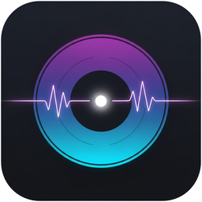
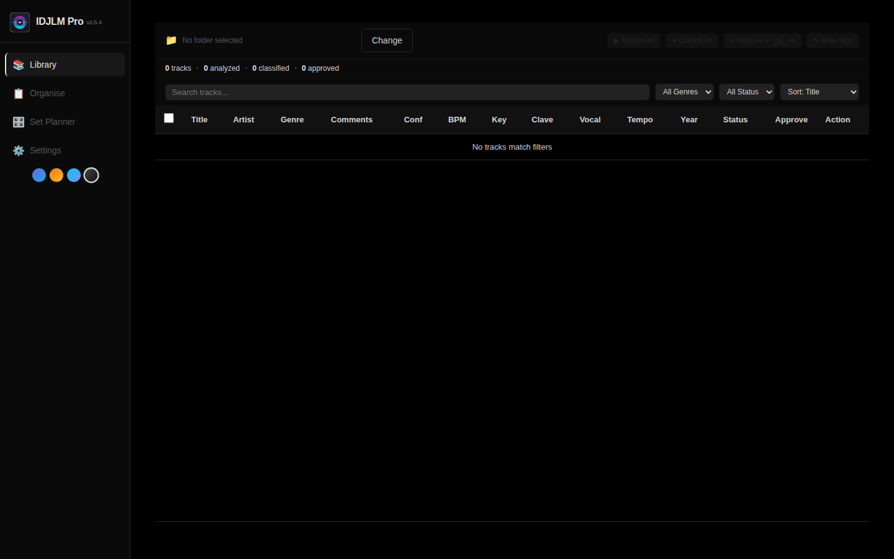
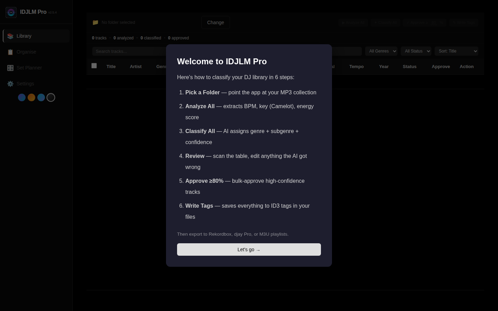
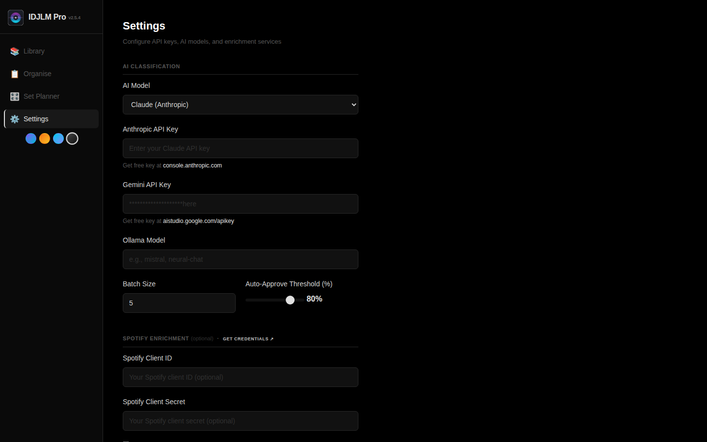
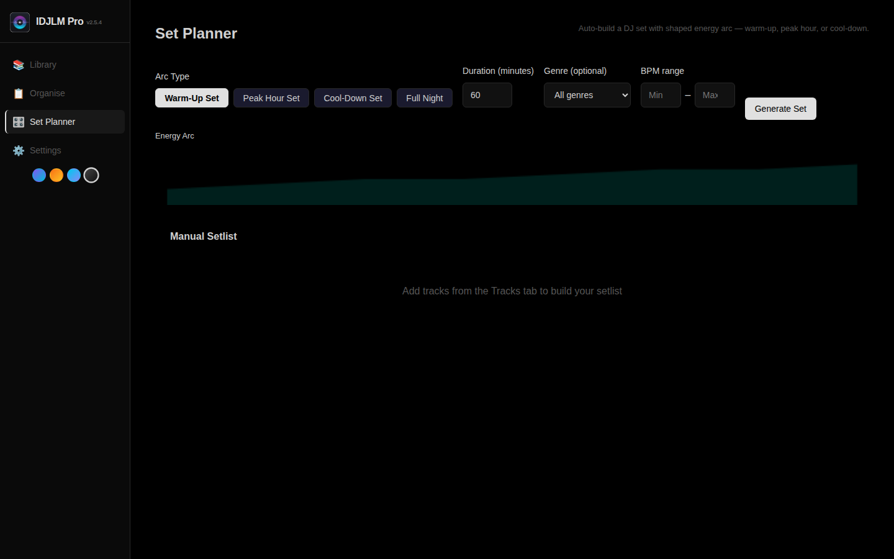

<p align="center">
  
</p>

<h1 align="center">Stop Guessing. Start Mixing.</h1>
<p align="center"><strong>IDJLM Pro</strong> — The AI that organises your music library so you can focus on the dancefloor.</p>

<p align="center">
  <a href="#download"><strong>Download Free</strong></a> · <a href="#how-it-works">See How It Works</a> · <a href="#what-you-get">Features</a>
</p>

<p align="center">
  
</p>

---

## The Problem You Know Too Well

You've spent years building your music library. Thousands of tracks. But half of them have **no tags**, **wrong genres**, or **missing BPM data**. Your DJ software can't find what you need when you need it.

Sound familiar?

**IDJLM Pro fixes that.** Point it at your music folder, and AI does the rest — genre, sub-genre, BPM, key, energy — everything written cleanly to your files. Your smart playlists work. Your mixes flow. Your sets build perfectly.

---

## How It Works

**Three steps. That's it.**

<p align="center">
  
</p>

| Step | What Happens | Time for 500 Tracks |
|------|-------------|---------------------|
| **1. Import** | Pick your music folder. All existing tags load instantly. | ~5 seconds |
| **2. Analyse** | BPM, key (Camelot), energy, loudness — all detected automatically. | ~3 minutes |
| **3. Classify** | AI assigns genre + sub-genre with confidence scores. | ~2 minutes |
| **4. Review** | Bulk-approve high-confidence tracks. Edit the rest. Undo if needed. | ~2 minutes |
| **5. Write Tags** | Clean tags written to your files. Backup created automatically. | ~30 seconds |

**Open djay Pro.** Your smart playlists just work. Filter by "Salsa Romántica" or "Bachata Sensual" — it's all there.

---

## What You Get

### 🎯 AI That Knows Your Genre
Most taggers think "Latin" is a genre. IDJLM Pro knows the difference between **Salsa Romántica** and **Salsa Dura**, between **Bachata Sensual** and **Bachata Dominicana**. It learns from your corrections — the more you use it, the better it gets.

> *"My library of 3,000 salsa tracks was classified in 4 minutes. I'd been meaning to do that for two years."*

### 🔍 Next Track Advisor
Stuck on what to play next? Select any track and IDJLM Pro ranks your best options — matching **key compatibility**, **BPM smoothness**, **energy level**, and **genre continuity**. It's like having a musical co-pilot.

### 📊 Set Planner That Understands Energy
Build sets that flow naturally. Choose an energy arc — **Warm-Up → Peak Hour → Cool-Down** — and IDJLM Pro picks tracks that fit. See every BPM transition rated: 🟢 smooth, 🟡 moderate, 🟠 challenging, 🔴 hard. No more train-wreck mixes.

### 🎵 Your Music, Enriched
Missing year? Cover art? BPM? IDJLM Pro checks **Spotify**, **Deezer**, **Last.fm**, and **Beatport** automatically — filling in what's missing. Free sources first, premium sources optional.

### 🔄 Undo Everything
Wrote tags you didn't mean to? Hit **Undo** on the success toast. Every write operation creates a backup. You're always one click away from your previous state.

### 📈 Know Your Collection
The stats dashboard tells you things you've always wanted to know:
- **Genre balance** — "78% Salsa, 15% Bachata, 7% Kizomba"
- **Key coverage map** — "You're missing tracks in 3A and 5B"
- **BPM gaps** — "Nothing between 105-112 BPM"
- **Decade spread** — visual breakdown of your library's era
- **Camelot wheel** — see which keys you're strongest in

---

## Supported Music

<p align="center">
  
  &nbsp;
  
</p>

**File types:** MP3 · FLAC · WAV · M4A · AAC · OGG · AIFF

**Genres out of the box:**
- **Salsa** — Romántica, Dura, Mambo, Jazz/Instrumental, Son Cubano, Timba, Salsa Choke
- **Bachata** — Dominicana, Moderna, Sensual, Remix/Urbana
- **Kizomba** — Clássica, Semba, Ghetto Zouk, Tarraxinha, Urban Kiz
- **Plus:** Cha Cha, Merengue, Reggaeton, Zouk — and you can add your own.

**Customise everything.** Your genres, your sub-genres, your rules. Export your taxonomy, share it, import someone else's.

---

## AI That Works Your Way

Choose from **6 AI providers** — or run completely free with no API key:

| Provider | Cost | Best For |
|----------|------|----------|
| **Google Gemini** | Free tier available | Most users — fast and accurate |
| **OpenRouter** | Free models available | 100+ model choices in one key |
| **Ollama** | 100% free, offline | Privacy-focused, no internet needed |
| **Claude (Anthropic)** | Paid | Highest quality classification |
| **OpenAI GPT** | Paid | Reliable, well-tested |
| **Qwen (Alibaba)** | Low cost | Great value, strong multilingual |

**One-click key testing.** Every provider has a **Test** button that validates your connection instantly — shows response time so you know it's working.

**Fallback protection.** If your primary AI goes down, IDJLM Pro automatically tries the next one. Your classification never stops.

---

## What DJs Say It's For

> *"I organise music for a living. This cut my tagging time from hours to minutes."*

> *"The Set Planner's BPM transition analysis saved me from some terrible mixes at my last gig."*

> *"Finally, something that understands Salsa isn't just one genre."*

---

## Download

| Platform | Get It |
|----------|--------|
| **macOS** (Intel + Apple Silicon) | [Latest DMG →](../../releases/latest) |
| **Windows** | [Latest ZIP →](../../releases/latest) |
| **From source** (Linux / dev) | See below ↓ |

No Python, no terminal, no config files needed for the desktop apps. Just open and go.

**In-app updates:** Click the version badge in the header or "Check for Updates" in Settings. Downloads and opens the new version for you.

---

## Run From Source (for developers)

<details>
<summary><strong>Quick start — 3 commands</strong></summary>

```bash
git clone https://github.com/xonline/idjlm-pro.git
cd idjlm-pro
./start.sh
```

`start.sh` creates a virtual environment, installs dependencies, and launches the app at `http://localhost:5050`.

**Configure AI:** Copy `config.example.env` to `.env` and add at least one AI key. Gemini has a free tier.

```bash
cp config.example.env .env
# Edit .env — set GEMINI_API_KEY or ANTHROPIC_API_KEY
```

</details>

---

## Keyboard Shortcuts

Press `?` anytime to see the full reference.

| Key | Action |
|-----|--------|
| `1-4` | Switch tabs |
| `/` | Focus search |
| `Space` | Play/pause preview |
| `Cmd+A` | Select all |
| `Enter` | Approve selected |
| `Cmd+S` | Save session |

---

## Version History

### v3.2.0 — Latest
- **Test your AI keys** with one click — see response time instantly
- **Undo after Write Tags** — one click restores your previous tags
- **BPM transition ratings** in Set Planner — see where your risky mixes are
- **Beatport integration** — fixed scraper, now more reliable

### v3.1.0
- Visual workflow stepper so you always know what stage you're at
- Onboarding wizard for first-time users
- Next Track Advisor — harmonic + BPM + energy matching
- rekordbox library integration
- Security hardening + automated testing

### v3.0.0
- 6 AI providers (was 4) — added OpenAI GPT + Qwen
- 4 enrichment sources — Deezer, Last.fm, Beatport + Spotify
- Multi-source enrichment chain — fills in missing metadata automatically

[See full changelog →](CHANGELOG.md)

---

<p align="center">
  <strong>IDJLM Pro</strong> — Built for DJs who'd rather mix than tag.
</p>

<p align="center">
  <a href="#download"><strong>Download Free</strong></a> · <a href="https://github.com/xonline/idjlm-pro">Source Code</a> · <a href="CHANGELOG.md">Changelog</a>
</p>
